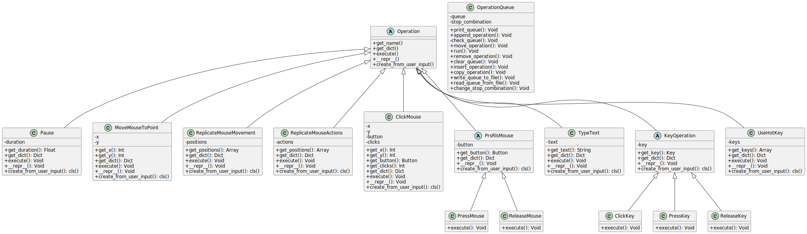

# Qbot: Tool for queuing mouse and keyboard operations

## Overview
This project is a final assignment for the **Object-Oriented Programming course** and demonstrates the core principles of the object-oriented paradigm, such as:

- **Abstraction**: Abstract classes define generic operations, and specific implementations are provided by their subclasses.
- **Encapsulation**: Implementation details are hidden within classes, and access to class data is controlled via public methods (getters/setters or other interface methods).
- **Polymorphism**: Different operations are executed through polymorphism, allowing objects of different derived types to be treated as instances of a base class.
- **Inheritance**: Derived classes, such as those handling keyboard and mouse interactions, extend from base classes to promote code reuse and support future extensibility.

The project enables the user to create and manage queues of mouse and keyboard operations, which can be saved, loaded, and executed in an automated manner. Main operations include simulating key presses, mouse movements, and time delays.
Qbot models real-world mouse and keyboard actions as objects and enables a user-friendly way of queuing and executing them. By utilizing object-oriented principles, each operation is defined as a class with well-structured behaviors, supporting extensibility and modularity.

Note: The project currently works only on **Windows**.

## Class diagram

The class diagram below illustrates the structure of Qbot, highlighting the relationships between different classes for mouse and keyboard operations.



## Features

The project offers a wide range of functionalities centered around handling **operation queues**, **mouse operations**, **keyboard operations**, and **persistent storage of operation queues**.

### 1. **Operation Queue Management**
   - Display the current queue of operations.
   - Execute the entire queue of operations.
   - Add a new operation to the end of the queue.
   - Insert a new operation at a specific index in the queue.
   - Remove an operation from the queue.
   - Move an operation to a different position in the queue.
   - Copy an existing operation and insert it at a specific index in the queue.
   - Clear the entire queue.
   - Interrupt the execution of the queue.
   - Change the hotkey combination that interrupts the queue execution.

### 2. **Mouse Operations**
   - Move the mouse cursor to a specific position.
   - Capture a snapshot of the mouse movement.
   - Capture both clicks and movements of the mouse.
   - Simulate a mouse click.
   - Simulate pressing, releasing and holding a mouse button.

### 3. **Keyboard Operations**
   - Simulate typing text.
   - Simulate clicking a keyboard key.
   - Simulate pressing, releasing and holding a keyboard key.
   - Use hotkey combinations to perform various actions.

### 4. **Persistent Storage of Operation Queues**
   - Save the current queue of operations to a JSON file.
   - Load a queue of operations from a JSON file, enabling the reuse of predefined operation sequences.

### 5. **Other Operations**
   - Time delay: Add a pause between operations for more controlled execution.

##Installation

1. **Clone the repository:**
   ```bash
   git clone https://github.com/krzsmal/QBot
   cd Qbot
   ```

2. **Install dependencies:**
   ```bash
   pip install -r requirements.txt
   ```

3. **Run the program:**
   ```bash
   python main.py
   ```

## License

This project is open-source under the MIT License.